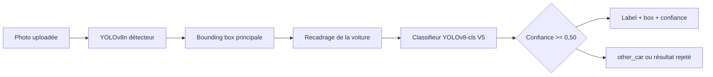

# Car Spotter AI

Car Spotter AI est une application open source de Computer Vision qui détecte
une voiture dans une photo, l'encadre et propose son modèle ainsi que sa
carrosserie. Le projet est conçu pour reconnaître des voitures américaines
classiques des années 1960, avec une interface Streamlit locale et un pipeline
d'entraînement reproductible basé sur YOLOv8.

> Projet personnel et démonstrateur expérimental. Les prédictions sont
> indicatives : pour obtenir de meilleurs résultats sur vos propres photos,
> constituez votre propre dataset et réentraînez le modèle avec vos propres
> poids.

## Fonctionnalités

- Détection de la voiture avec YOLOv8n.
- Recadrage de la voiture principale et dessin d'une bounding box.
- Classification fine avec un modèle YOLOv8-cls.
- Identification de la carrosserie Mustang : Fastback, Hardtop ou Convertible.
- Classe de rejet `other_car` pour limiter les faux positifs.
- Affichage du modèle, de la carrosserie et de la confiance directement sur
  l'image.
- Interface Streamlit moderne, responsive et exécutable localement ou dans un
  conteneur Docker.
- Outils de collecte, recadrage, revue humaine, préparation de dataset,
  validation et entraînement.

## Périmètre du modèle fourni

Le checkpoint distribué dans `weights/classifier-best.pt` est le modèle V5
final du MVP. Il couvre actuellement sept classes :

| Classe | Description |
| --- | --- |
| `ford_mustang_fastback_classic` | Ford Mustang Fastback classique |
| `ford_mustang_hardtop_classic` | Ford Mustang Hardtop classique |
| `ford_mustang_convertible_classic` | Ford Mustang Convertible classique |
| `chevrolet_camaro_classic` | Chevrolet Camaro classique |
| `chevrolet_corvette_classic` | Chevrolet Corvette classique |
| `dodge_charger_classic` | Dodge Charger classique |
| `other_car` | Véhicule hors périmètre ou non identifiable |

Le modèle distingue la carrosserie Mustang, mais ne garantit pas l'année exacte
ni la génération exacte dans chaque photo. Challenger et Impala sont prévus
comme extensions futures et ne font pas partie du checkpoint fourni.

Les résultats de l'évaluation V5 sont disponibles dans
[`reports/model_v5_evaluation.md`](reports/model_v5_evaluation.md). Le modèle
est adapté à une démonstration personnelle, mais ne doit pas être présenté
comme un système de production ou d'identification fiable à 100 %.

## Stack technique

- Python 3.10 ou supérieur.
- [Ultralytics YOLOv8](https://github.com/ultralytics/ultralytics) pour la
  détection et la classification.
- PyTorch et torchvision pour l'inférence et l'entraînement.
- Streamlit 1.39 pour l'interface web.
- Pillow et NumPy pour le traitement d'image.
- Docker avec une image multi-stage `python:3.10-slim-bookworm`.
- Utilisateur Docker non-root `appuser`.
- Dépendances verrouillées dans [`requirements.txt`](requirements.txt).

## Architecture

```text
.
├── app.py                              # Interface Streamlit principale
├── model.py                            # API publique d'inférence
├── photo_model.py                      # Détection + classification photo
├── dataset_review_app.py               # Revue humaine des images
├── dataset_config.py                   # Taxonomies et profils typés
├── review_store.py                     # Sauvegarde des décisions de revue
├── train_classifier.py                 # Entraînement YOLOv8-cls
├── taxonomy_migration.py               # Migration entre taxonomies
├── config/
│   ├── taxonomy_vehicle_v3.json        # Classes et métadonnées V3
│   └── profiles/                       # Profils de collecte et d'entraînement
├── scripts/
│   ├── download_wikimedia.py           # Collecte avec métadonnées de licence
│   ├── collect_open_images_negatives.py# Collecte de négatifs génériques
│   ├── crop_dataset.py                 # Détection et recadrage YOLO
│   ├── merge_review_dataset.py         # Fusion de files de revue
│   ├── prepare_classification_dataset.py
│   ├── validate_classification_dataset.py
│   └── evaluate_photo_spotter.py       # Évaluation end-to-end
├── datasets/                           # Données locales, ignorées par Git
├── runs/                               # Sorties d'entraînement, ignorées par Git
├── weights/
│   └── classifier-best.pt              # Checkpoint V5 distribué
├── requirements.txt
├── Dockerfile
└── tests/
```

## Pipeline d'inférence



Le détecteur et le classifieur sont volontairement séparés. Le détecteur
répond à « où est la voiture ? », tandis que le classifieur répond à « quelle
classe lui correspond ? ». Le seuil applicatif V5 est fixé à `0.50` pour
réduire les faux positifs observés sur les véhicules hors cible.

## Pipeline de données et d'entraînement

```mermaid
flowchart LR
    A[Sources d'images] --> B[datasets/<experiment>/raw]
    B --> C[crop_dataset.py]
    C --> D[Recadrages + manifest]
    D --> E[Revue humaine Streamlit]
    E --> F[prepare_classification_dataset.py]
    F --> G[train / val / test]
    G --> H[validate_classification_dataset.py]
    H --> I[train_classifier.py]
    I --> J[runs/classify/.../weights/best.pt]
    J --> K[Évaluation terrain]
    K --> L[weights/classifier-best.pt]
```



La séparation par source et la revue humaine sont importantes. Elles évitent
de placer des images quasi identiques dans `train` et `test`, et permettent de
rejeter les intérieurs, les photos trop éloignées, les images ambiguës et les
véhicules hors sujet.

## Setup local complet

### Prérequis

- macOS, Linux ou Windows avec Python 3.10+.
- Git.
- Environ 5 à 10 Go d'espace libre pour les dépendances, les images et les
  sorties d'entraînement.
- Pour un Mac Apple Silicon, PyTorch peut utiliser `mps`.
- Pour Docker, Docker Desktop doit être installé et démarré.

### 1. Cloner le dépôt

```bash
git clone https://github.com/starsamk/muscle-car-detector.git
cd muscle-car-detector
```

Ces commandes téléchargent le code et placent le terminal à la racine du
projet.

### 2. Créer l'environnement Python

```bash
python3 -m venv .venv
source .venv/bin/activate
```

La première commande crée un environnement isolé dans `.venv`. La seconde
active cet environnement pour que les commandes `python` et `pip` utilisent les
versions du projet.

Sous Windows PowerShell :

```powershell
py -3 -m venv .venv
.venv\Scripts\Activate.ps1
```

### 3. Installer les dépendances

```bash
python -m pip install --upgrade pip
python -m pip install -r requirements.txt
```

La première commande met `pip` à jour. La seconde installe les versions
verrouillées de NumPy, Pillow, Streamlit, PyTorch, torchvision et Ultralytics.

### 4. Vérifier le checkpoint fourni

Le poids V5 est déjà fourni dans le dépôt :

```bash
ls -lh weights/classifier-best.pt
```

Le fichier est chargé automatiquement par défaut. Il est possible de vérifier
le chemin et le seuil utilisés par l'application avec :

```bash
export CAR_SPOTTER_CLASSIFIER_PATH=weights/classifier-best.pt
export CAR_SPOTTER_CLASSIFICATION_CONFIDENCE=0.50
export CAR_SPOTTER_DEVICE=mps
```

Sur une machine sans Apple Silicon, remplacez `mps` par `cpu`. Le mot-clé
`auto` est aussi accepté et sélectionne le meilleur périphérique disponible.

### 5. Lancer l'application

```bash
streamlit run app.py
```

Cette commande démarre l'interface principale sur
<http://localhost:8501>. Importez une photo extérieure, cliquez sur
**Analyser la photo**, puis consultez l'image annotée et les classes prédites.

Pour arrêter l'application :

```bash
Ctrl+C
```

### 6. Lancer les tests et les contrôles qualité

```bash
.venv/bin/ruff check .
.venv/bin/ruff format --check .
.venv/bin/python -m unittest discover -s tests -p 'test_*.py'
```

Ces commandes vérifient respectivement les erreurs de style, le formatage et
les tests unitaires du pipeline.

## Utiliser vos propres données

Le checkpoint fourni est un point de départ, pas une garantie de résultat sur
un autre appareil photo, une autre région, un autre cadrage ou une autre
taxonomie. Il est vivement recommandé de constituer votre propre dataset et
de réentraîner le modèle avec vos propres poids si vous voulez l'utiliser sur
des photos de terrain spécifiques.

### Option A — Dataset de classification déjà préparé

Pour un premier entraînement simple, créez cette arborescence sous `datasets/`.
Le dossier `datasets/` est ignoré par Git : vos images personnelles ne seront
pas poussées dans le dépôt.

```text
datasets/classification_vehicle_custom/
├── train/
│   ├── ford_mustang_fastback_classic/
│   ├── ford_mustang_hardtop_classic/
│   ├── ford_mustang_convertible_classic/
│   ├── chevrolet_camaro_classic/
│   ├── chevrolet_corvette_classic/
│   ├── dodge_charger_classic/
│   └── other_car/
├── val/
│   └── mêmes classes que train/
└── test/
    └── mêmes classes que train/
```

Chaque classe contient ses propres fichiers `.jpg`, `.jpeg`, `.png` ou `.webp`.
Les trois dossiers doivent contenir exactement les mêmes classes.

Conseils de constitution :

- Visez au moins 200 à 500 images réellement différentes par classe.
- Gardez les classes équilibrées autant que possible.
- Variez les angles, distances, saisons, couleurs, arrière-plans et conditions
  de lumière.
- Mettez les images issues d'une même série ou d'une même source dans un seul
  split afin d'éviter les fuites entre entraînement et test.
- Ajoutez des négatifs difficiles dans `other_car` : modèles proches,
  versions modernes, véhicules vus dans vos conditions réelles et photos sans
  voiture exploitable.
- Ne mélangez pas les intérieurs, les détails de logo et les photos trop
  recadrées avec les photos extérieures destinées à la détection.

Validez ensuite la structure :

```bash
python -m scripts.validate_classification_dataset \
  --data datasets/classification_vehicle_custom \
  --taxonomy config/taxonomy_vehicle_v3.json \
  --profile config/profiles/vehicle_taxonomy_v3.json \
  --minimum-per-split 20
```

### Option B — Pipeline complète avec collecte, recadrage et revue

Cette option est préférable pour un dataset traçable. Les images et leurs
métadonnées restent dans `datasets/<nom-de-lexperience>/` :

```text
datasets/my_vehicle_experiment/
├── raw/
│   ├── images/
│   └── manifest.jsonl
├── cropped/
│   └── manifest.jsonl
├── review/
│   ├── decisions.json
│   └── deleted.json
└── classification/
    ├── train/
    ├── val/
    └── test/
```

Pour une collecte Wikimedia avec attribution et licence :

```bash
python -m scripts.download_wikimedia \
  --taxonomy config/taxonomy_vehicle_v3.json \
  --profile config/profiles/vehicle_taxonomy_v3.json \
  --output datasets/my_vehicle_experiment/raw \
  --limit-per-category 100 \
  --target-per-class 200
```

Cette commande télécharge les images dans `raw/`, crée un manifeste JSONL et
conserve l'URL, le titre, l'auteur, la licence et le SHA-256 de chaque fichier.
Pour vos images locales, vous pouvez aussi utiliser l'Option A ou produire un
manifeste équivalent ; ne poussez jamais les photos privées dans Git.

Recadrez la voiture principale :

```bash
python -m scripts.crop_dataset \
  --manifest datasets/my_vehicle_experiment/raw/manifest.jsonl \
  --output datasets/my_vehicle_experiment/cropped \
  --taxonomy config/taxonomy_vehicle_v3.json \
  --profile config/profiles/vehicle_taxonomy_v3.json \
  --model yolov8n.pt \
  --device mps
```

Le détecteur sélectionne la voiture principale. Les photos sans voiture ou
avec plusieurs voitures ambiguës sont marquées pour exclusion au lieu d'être
envoyées directement à l'entraînement.

Lancez ensuite la revue humaine sur un port dédié :

```bash
export CAR_SPOTTER_REVIEW_MANIFEST=datasets/my_vehicle_experiment/cropped/manifest.jsonl
export CAR_SPOTTER_REVIEW_DECISIONS=datasets/my_vehicle_experiment/review/decisions.json
export CAR_SPOTTER_REVIEW_DELETED=datasets/my_vehicle_experiment/review/deleted.json
export CAR_SPOTTER_REVIEW_TAXONOMY_PATH=config/taxonomy_vehicle_v3.json
export CAR_SPOTTER_REVIEW_PROFILE_PATH=config/profiles/vehicle_taxonomy_v3.json
streamlit run dataset_review_app.py --server.port 8503
```

Validez chaque image dans l'interface. Une image doit être acceptée uniquement
si le véhicule est visible, exploitable et correctement classé. Les images
supprimées sont enregistrées dans `deleted.json` et ne doivent pas être
réintroduites silencieusement.

Préparez alors les splits reproductibles :

```bash
python -m scripts.prepare_classification_dataset \
  --manifest datasets/my_vehicle_experiment/cropped/manifest.jsonl \
  --decisions datasets/my_vehicle_experiment/review/decisions.json \
  --deleted datasets/my_vehicle_experiment/review/deleted.json \
  --taxonomy config/taxonomy_vehicle_v3.json \
  --profile config/profiles/vehicle_taxonomy_v3.json \
  --output datasets/my_vehicle_experiment/classification \
  --force
```

La commande répartit les images en `train` (70 %), `val` (15 %) et `test`
(15 %), en regroupant les sources pour réduire les fuites de données. Par
défaut, seules les images ayant reçu une décision humaine positive sont
retenues. N'utilisez `--allow-unreviewed` que pour un essai technique.

## Réentraîner le classifieur

### Recommandation de base

Pour une taxonomie différente ou un nouveau projet, partez du poids de
classification YOLOv8 préentraîné :

```bash
caffeinate -dimsu .venv/bin/python train_classifier.py \
  --data datasets/classification_vehicle_custom \
  --model yolov8s-cls.pt \
  --device mps \
  --epochs 50 \
  --image-size 320 \
  --batch-size 8 \
  --workers 4 \
  --patience 10 \
  --name classic-car-classifier-custom
```

Sur Mac, `caffeinate` empêche la mise en veille pendant l'entraînement. Le
script vérifie les splits, sélectionne automatiquement `mps` avec
`--device auto`, utilise une seed déterministe et écrit les sorties dans :

```text
runs/classify/classic-car-classifier-custom/
└── weights/best.pt
```

### Fine-tuner le modèle V5 fourni

Si votre dataset conserve exactement les sept classes actuelles, vous pouvez
initialiser le nouvel entraînement avec le modèle fourni. Cette stratégie
conserve une partie des connaissances V5 tout en adaptant le modèle à vos
photos :

```bash
caffeinate -dimsu .venv/bin/python train_classifier.py \
  --data datasets/classification_vehicle_custom \
  --model weights/classifier-best.pt \
  --device mps \
  --epochs 40 \
  --image-size 320 \
  --batch-size 8 \
  --workers 4 \
  --optimizer AdamW \
  --learning-rate 0.0003 \
  --freeze 9 \
  --patience 10 \
  --name classic-car-classifier-custom-finetune
```

Utilisez plutôt `yolov8s-cls.pt` si vous ajoutez ou retirez des classes, si
vous changez fortement la taxonomie ou si vos labels ne correspondent plus au
profil V3. `--freeze 9` et le faible taux d'apprentissage sont adaptés à un
fine-tuning conservateur ; ils ne sont pas obligatoires pour un entraînement
entièrement nouveau.

### Valider avant de remplacer le poids actif

Ne remplacez pas immédiatement le poids fourni. Vérifiez d'abord le split de
test et un jeu terrain indépendant :

```bash
python -m scripts.validate_classification_dataset \
  --data datasets/classification_vehicle_custom \
  --taxonomy config/taxonomy_vehicle_v3.json \
  --profile config/profiles/vehicle_taxonomy_v3.json \
  --minimum-per-split 20

python -m scripts.evaluate_photo_spotter \
  --manifest datasets/field_evaluation_v3/raw/manifest.jsonl \
  --weights runs/classify/classic-car-classifier-custom/weights/best.pt \
  --taxonomy config/taxonomy_vehicle_v3.json \
  --device mps
```

Le jeu `field_evaluation_v3` doit rester indépendant : il ne doit jamais être
copié dans le dataset d'entraînement. Comparez les faux positifs `other_car`,
les performances Fastback et Hardtop, et les erreurs par classe avant toute
promotion.

Après validation, conservez une sauvegarde et activez le nouveau poids :

```bash
cp weights/classifier-best.pt weights/classifier-backup.pt
cp runs/classify/classic-car-classifier-custom/weights/best.pt weights/classifier-best.pt
export CAR_SPOTTER_CLASSIFIER_PATH=weights/classifier-best.pt
streamlit run app.py
```

Le fichier `weights/classifier-best.pt` est le seul checkpoint distribué par
le dépôt. Les backups locaux et les résultats d'expériences restent ignorés
par Git.

## Sources et licences du dataset

Les sources, licences et règles de revue sont documentées dans
[`docs/dataset_sources.md`](docs/dataset_sources.md).

- Wikimedia Commons est utilisé pour les modèles ciblés et les négatifs
  difficiles avec conservation des attributions.
- Open Images peut compléter `other_car` avec des véhicules génériques et des
  boîtes de détection.
- Roboflow Universe peut fournir des pistes, mais chaque projet doit être
  audité séparément avant intégration.
- Stanford Cars / Cars196 est une référence de recherche et ne doit pas être
  redistribué automatiquement dans le dataset du projet sans vérifier ses
  conditions d'utilisation.

Ne publiez pas d'images privées, de secrets, de tokens ou de données
personnelles dans le dépôt. Le checkpoint fourni est public avec le code ; il
peut donc être téléchargé par toute personne ayant accès au repository.

## Docker

Le `Dockerfile` utilise deux stages pour séparer l'installation des
dépendances et l'image d'exécution. Le processus final tourne avec un
utilisateur non-root et embarque le checkpoint actif fourni dans
`weights/classifier-best.pt`.

Construire l'image :

```bash
docker build -t car-spotter-ai .
```

Lancer le conteneur :

```bash
docker run --rm --name car-spotter \
  --publish 8501:8501 \
  car-spotter-ai
```

Vérifier le health-check dans un autre terminal :

```bash
curl http://127.0.0.1:8501/_stcore/health
```

La réponse attendue est `ok`. L'application est alors disponible sur
<http://localhost:8501>.

## Démo publique optionnelle

Le dépôt peut être déployé sur Streamlit Community Cloud en sélectionnant la
branche `main` et le fichier `app.py`. Le checkpoint actif étant fourni dans
Git, l'application dispose directement de ses poids. La plateforme peut
ensuite être ajoutée au README avec une URL `streamlit.app`.

GitHub Pages n'est pas adapté à l'exécution de cette application : Pages sert
des fichiers statiques, alors que Car Spotter nécessite un processus Python,
PyTorch et Ultralytics.

## État du projet

- Modèle actif : V5.
- Mode actuel : classification de photos uniquement.
- Tracking vidéo : prévu pour une extension future, non inclus dans le MVP.
- Dataset d'entraînement fourni : utilisé pour le checkpoint V5, mais non
  destiné à remplacer un dataset adapté à votre cas d'usage.
- Toute nouvelle version du modèle doit être évaluée sur un jeu terrain
  indépendant avant de remplacer le checkpoint actif.
